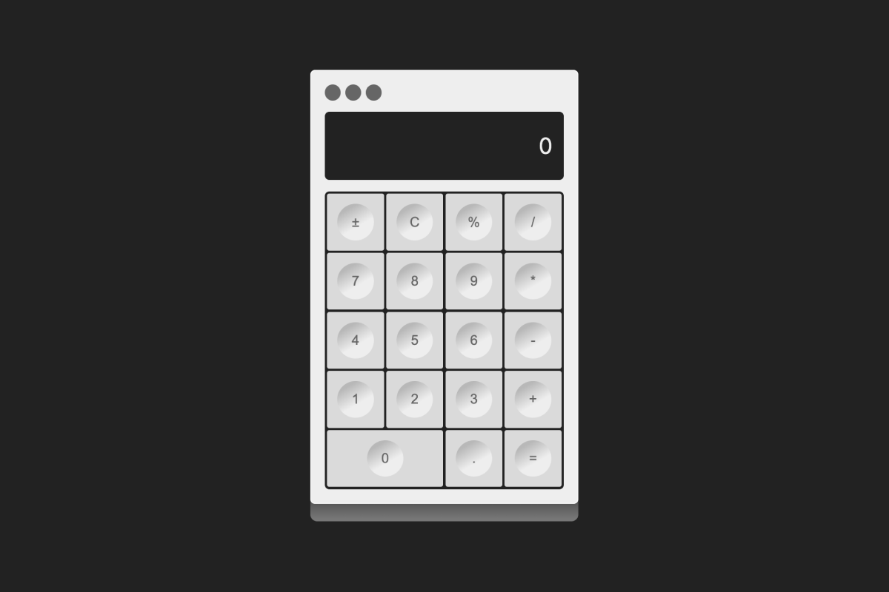

# 🧮 Calculator



### 나만의 계산기 구현하기 | JS Final Mission in OZ

- 🚀 [Live Demo (GitHub Pages)](https://miloupark.github.io/calculator/)
- 작업 기간: 2025-07-25 ~ 2025-07-30
- 작업 로그: [Binyard Blog](https://binyard.me/OZ/fe/mission.html)
- 디자인 시안: [Figma](https://www.figma.com/design/hh1hbNBF5992A1dQYb6INU/Calculator?node-id=0-1&t=AJexyvuflp4TE5th-1)

<br>

## 🗂️ JavaScript 최종과제 가이드

<details>
<summary>DAY1 미션지</summary>

#### STEP 1. HTML로 목업 만들기

요구사항

1. HTML 파일을 생성하고 기본 구조를 작성하세요.

2. CSS 초기화 코드를 입력해주세요.

<br>

구현 단계

1. `index.html`

- body 요소 내부에 계산기 컨테이너를 만듭니다.
- flex를 이용하여 컨테이너가 화면의 중간에 위치하도록 합니다.
- 컨테이너 내부에 2개의 영역을 생성합니다. (display, buttons)
- 각 영역을 시각적으로 확인할 수 있도록 border 속성을 추가합니다.
- `display`와 `buttons`를 flex를 사용하여 적절하게 배치합니다.
- 계산기 컨테이너의 내부 여백을 적절하게 설정합니다.

  <br>

#### STEP 2. 계산기 상단에 버튼 추가하기 (도전미션)

요구사항

1. 계산기 상단에 버튼을 3개 추가하세요.

- 맥북 계산기의 디자인 모티브로 하지만, 기능은 동작하지 않아도 됩니다.
- 버튼은 원 형태이고, 각 버튼이 일정한 간격을 갖도록 구현해야 합니다.

      <br>

  </details>

<details>
<summary>DAY2 미션지</summary>

#### STEP 1. HTML로 목업 만들기, flexbox로 정렬 및 배치하기

요구사항

1. CSS의 flexbox 속성을 이용해 계산기 레이아웃을 구성하세요.
2. 계산기의 기본 구성 요소를 추가하세요 (디스플레이, 숫자 버튼, 연산자 버튼 등).

<br>

구현 단계

1. `index.html`

- buttons 내부에 계산기에 필요한 버튼을 추가합니다.

  - 모든 버튼은 `button` class를 가지고 있어야 합니다.
  - 숫자 버튼에는 `number` class를 추가합니다.
  - 연산기호 버튼(`+`, `-`, `*`, `/`)에는 `operator` class를 추가합니다.
  - 기능 버튼(`C`, `±`, `%`)에는 `function` class를 추가합니다.
  - 숫자 0은 다른 버튼에 비해 두 배의 영역을 가지고 있으므로, `zero` class를 추가합니다.

2. `style.css`

- display 영역을 스타일링합니다.

  - 텍스트를 오른쪽으로 정렬합니다.
  - 콘텐츠와 테두리 사이에 padding을 지정합니다.

- buttons 영역과 버튼들을 flexbox를 사용하여 정렬합니다.

<br>

#### STEP 2. 버튼에 hover 및 active 효과 추가하기

요구사항

- 버튼에 마우스를 올리면(`hover`) 배경색이 변경되도록 하세요.
- 버튼을 클릭하면(`active`) 배경색이 잠시 변경되도록 하세요.

<br>
</details>

<details>
<summary>DAY3 미션지</summary>

### STEP 1. 버튼 클릭 시 디스플레이에 표시되도록 만들기

### 1-1. 각 버튼을 클릭했을 때 console에 각 버튼의 value가 나오도록 하기

요구사항

1. 각 버튼을 클릭했을 때 해당 버튼의 값을 콘솔에 출력하세요.

<br>

구현 단계

1. `script.js`

- 모든 버튼 요소를 선택합니다.
- 각 버튼에 클릭 이벤트 리스너를 추가합니다.
  - 참고: [MDN: 배열 메서드 forEach()](https://developer.mozilla.org/ko/docs/Web/JavaScript/Reference/Global_Objects/Array/forEach)
- 버튼이 클릭되었을 때, 해당 버튼의 값을 콘솔에 출력합니다.
  - 참고: [MDN: Event.target](https://developer.mozilla.org/ko/docs/Web/API/Event/target)

<br>

### 1-2. 숫자를 디스플레이에 표시하기

요구 사항

- 숫자 버튼을 클릭하면 디스플레이에 해당 숫자가 표시되도록 하세요.
- 초기 디스플레이 값이 `0`일 때는 클릭한 숫자로 바뀌어야 합니다.
- 초기 값이 `0`이 아닐 때는 클릭한 숫자가 뒤에 추가되어야 합니다.
- 클래스가 `number`인 버튼에 대해서만 처리하세요.

<br>

구현 단계

1. `script.js`

- 모든 버튼 요소와 디스플레이 요소를 선택합니다.
- 각 버튼에 클릭 이벤트 리스너를 추가합니다.
- 버튼이 클릭되었을 때, 클래스가 `number`인 경우 디스플레이에 값을 표시합니다.
- 디스플레이가 `0`일 때는 클릭한 숫자로 바뀌어야 합니다.
- 디스플레이가 `0`이 아닐 때는 클릭한 숫자가 뒤에 추가되어야 합니다.

<br>

### STEP 2. 소수점과 Clear 기능 추가하기

요구 사항

- 소수점(`.`) 버튼을 클릭하면 디스플레이에 소수점을 추가하세요. (이미 소수점이 있는 경우 추가되지 않도록)
- `C` 버튼을 클릭하면 디스플레이를 `0`으로 초기화하세요.

<br>

### 추가 참고 자료

- [MDN: JavaScript 이벤트](https://developer.mozilla.org/ko/docs/Web/API/Event)
- [MDN: Element.classList](https://developer.mozilla.org/ko/docs/Web/API/Element/classList)

</details>

<details>
<summary>DAY4 미션지</summary>

### STEP 1. 계산 기능 구현하기

### 1-1. 디스플레이에 숫자를 입력한 다음 연산기호를 누르면 디스플레이에 있는 숫자를 firstOperand로 저장하고 연산기호를 기억하기

요구 사항

- 디스플레이에 숫자를 입력한 다음 연산기호를 누르면 디스플레이에 있는 숫자를 `firstOperand`로 저장하고 연산기호를 기억합니다.
- 연산기호를 누른 후 디스플레이에 다른 숫자를 입력하면 새로운 숫자가 디스플레이에 입력되도록 합니다.

<br>

구현단계

1. `firstOperand`, `operator` 변수를 선언합니다.
   - `firstOperand`: 첫 번째 피연산자를 저장할 변수입니다.
   - `operator`: 연산자를 저장할 변수입니다.
2. 연산기호 버튼이 클릭되면 현재 디스플레이 값을 `firstOperand`로 저장하고, 연산기호를 기억합니다.
   - 첫 번째 피연산자가 `null`이면 현재 디스플레이 값을 `firstOperand`로 저장합니다.
   - `operator` 변수에 클릭한 연산기호를 값으로 할당합니다.
   - `firstOperand`와 `operator`를 console에 출력합니다.
3. 연산기호 버튼이 클릭된 후 디스플레이에 다른 숫자를 입력하면 새로운 숫자가 디스플레이에 입력되도록 합니다.
   - 연산기호 버튼이 클릭된 후 두 번째 숫자를 입력하면 디스플레이의 값이 새로 입력한 숫자로 바뀝니다.

<br>

### 1-2. calculate 함수 구현 및 = 버튼 클릭 시 계산 수행

요구 사항

- 매개 변수로 두 숫자를 입력 받아서 결과를 반환하는 `calculate` 함수를 만듭니다.
- `=` 버튼을 누르면 `firstOperand`, `operator`, `secondOperand`를 전달하여 계산이 되도록 합니다.
- 계산결과가 나온 후에는 새로운 숫자를 누를 시에 디스플레이가 초기화되도록 합니다.

구현 단계

1. `calculate` 함수를 구현합니다.
2. `=` 버튼이 클릭되면 `firstOperand`, `operator`, `secondOperand`를 전달하여 계산을 수행하고 결과를 디스플레이에 표시합니다.
3. 표시된 결과는 숫자 버튼을 누를 시에 사라지며, 누른 숫자를 표시합니다.

<br>

### STEP 2. 🔢 연산자 버튼을 반복해서 눌렀을 때 계산이 되도록 구현하기

요구 사항

- 연산자 버튼을 반복해서 눌렀을 때 이전 연산을 수행하고 새로운 연산을 시작할 수 있도록 구현하세요.
- `=` 버튼을 눌러서 계산이 된 다음, 새로운 숫자를 입력하고 연산자 버튼을 누르면, 먼저 디스플레이에 있었던 값이 `firstOperand`, 새로운 숫자를 `secondOperand`로 해서 계산이 이루어지도록 합니다.

<br>

구현 단계

1. 사용자가 **숫자를 입력**한 후, **연산자 버튼**을 누르는 경우
   - 입력한 숫자를 `firstOperand`에 저장하고, 연산자를 `operator`에 저장하세요.
2. 사용자가 **다시 숫자를 입력**하고, **연산자 버튼을 또 누르는 경우**
   - 현재 입력된 숫자를 `secondOperand`에 저장하고
   - 이전의 `firstOperand`와 `operator`, `secondOperand`로 **계산**하세요.
   - 계산된 결과를 디스플레이에 보여주고, 그 값을 다시 `firstOperand`로 저장하세요.
   - 그리고 누른 연산자 버튼의 값을 `operator`로 다시 저장하세요.
3. 사용자가 **`=` 버튼을 누르는 경우**
   - 현재 입력된 숫자를 `secondOperand`에 저장하고
   - `firstOperand`, `operator`, `secondOperand`로 **계산**하세요.
   - 결과를 디스플레이에 보여주고, `firstOperand`를 **결과값**으로 업데이트하세요.
4. 계산이 끝난 후 사용자가 **새 숫자를 입력하고 연산자 버튼을 누르는 경우**
   - 입력한 숫자를 `secondOperand`로 저장해서
   - 이전의 결과값과 새 숫자로 **새로운 계산**을 시작하세요.

<br>

### 힌트

- **연산자 버튼을 누른 경우**
  - 첫 계산 이후에 `firstOperand`나 `operator`가 null이 아니므로, 이것을 조건으로 `calculate` 함수를 호출할 수 있습니다.
    - `firstOperand`와 `operator`가 **이미 존재하면**, 현재 디스플레이 값을 `secondOperand`로 저장한 후 계산을 먼저 수행하세요.
  - 그다음, 연산자를 새로 저장하세요.
- **숫자는 문자열이기 때문에 계산할 때는** `parseFloat()`을 사용해서 **숫자 타입**으로 변경해야 합니다.

<br>

### 테스트 케이스

| **입력** | **디스플레이** | **동작**                                                    |
| -------- | -------------- | ----------------------------------------------------------- |
| 3        | 3              | 숫자 입력                                                   |
| `+`      | 3              | `firstOperand` = 3, `operator`= `+`                         |
| 5        | 5              | 숫자 입력                                                   |
| `+`      | 8              | ➡️ 3 + 5 = 8 계산,<br> `firstOperand` = 8, `operator` = `+` |
| 2        | 2              | 숫자 입력                                                   |
| `=`      | 10             | ➡️ 8 + 2 = 10 계산                                          |

</details>

<br>

## 📁 Folder Structure

```plaintext
calculator/
├── index.html
├── src/
│   ├── style.css
│   └── script.js
├── README.md
├── .gitignore
└── package.json
```

<br>

## 📍 Class Naming Convention

> 이 프로젝트는 BEM(Block Element Modifier) 방식을 기반으로 클래스명을 작성하되, 일부 유틸리티 클래스는 예외로 처리합니다.

### 필수 클래스

```plaintext
button     // 모든 버튼 공통
number     // 숫자 버튼 (0~9)
operator   // 연산자 버튼 (+ - * /)
function   // 기능 버튼 (C, ±, % 등)
zero       // 0번 버튼 (2칸 영역)
```

- `DAY 2`에서 명시된 필수 클래스명 입니다. 아래 클래스는 반드시 포함되어야 합니다.

<br>

### 개인 네이밍 기준 (BEM 기반)

```plaintext
.calc__display     /* calculator의 display 영역 */
.calc__keypad      /* calculator의 button 영역 */
```

- `calculator`는 축약하여 `calc`로 사용합니다.

<br>

⚠️ 예외: 유틸리티 클래스

```plaintext
.p-40
.btn-xs
```

- 재사용 목적의 디자인 도우미 클래스는 BEM 규칙을 따르지 않습니다.
- 구조보다 스타일 목적이 우선되는 클래스이며, 자유롭게 사용 가능합니다.

<br>

⚠️ 예외: `.calc-container`는 독립 스타일링을 위한 Wrapper

```plaintext
.calc-container
```

- `.calc-container`는 전체 레이아웃을 구성하기 위한 wrapper로 사용되며, BEM의 Block으로 취급하지 않습니다.
- 따라서 내부 요소들을 .calc-container\_\_display처럼 연결하지 않고, .calc\_\_display, .calc\_\_keypad등으로 구성합니다.

<br>

## 📦 Assets

- Icons from [Lucide Icons](https://lucide.dev/)
